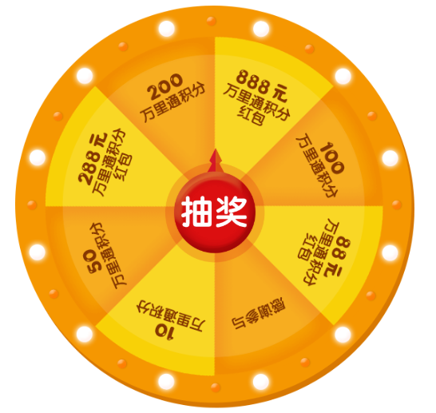

# 转盘抽奖组件
----
#### 基础用法
``` html
       <te-circleLottery :data="circleData" @lotteryDone="lotteryDone"></te-circleLottery> // 事件会将抽奖结束的状态返回
```
#### 适配：移动端、PC端
#### 数据结构
``` json 
      "circleData": {
        "outBg": string,  // 背景图
        "outWidth": string, // 宽度   (需带单位，pc端：px；移动端：实际宽度/32rem)
        "outHeight": string,   // 高度  (需带单位，pc端：px；移动端：实际宽度/32rem)
        "innerBg": string,    // 奖品内容区域背景图
        "pointBg": string,   // 转盘指针背景图
        "total": number,    // 奖品总数
        "prizeNum": number // 获奖奖品索引  （从起点开始逆时针计算，从1开始）
      }
```
----
#### 示例图
