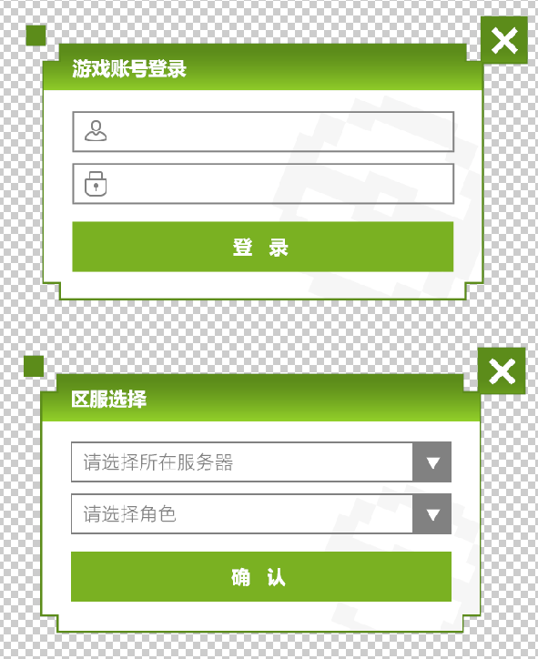

# 游戏登录组件
----
#### 基础用法
``` html
      <te-login
      class="login"
      :svrList="svrList"
      :isShowSvr="isShowSvr"
      :isShowlogin="isShowlogin"
      :LoginStyle="LoginStyle"
      @userInfo="userInfo"
      @svrInfo="svrInfo"
      @loginClose="loginClose"
      @svrClose="svrClose"
    ></te-login>
```
#### 适配：移动端、PC端
#### 数据结构
``` json 
        "LoginStyle": {            // 登录框样式 (所有数值都需带单位，pc端：px；移动端：实际宽度/32rem)
            "width": string,       // 总宽度 
            "height": string,      // 总高度
            "aBg": string,         //  账户信息登录框背景图(包含除提示语外的所有内容)
            "sBg": string,         // 服务器选择框背景图(包含除提示语外的所有内容)
            "uBgColor": string,    // 下拉列表背景颜色
            "lColor": string,      // 下拉列表字体颜色
            "iWidth": string,      // 输入框、下拉选择框、确认按钮宽度
            "iHeight": string,     // 输入框、下拉选择框宽度
            "iLeft": string,       //  输入框、下拉选择框、确认按钮的left
            "paddingLeft": string, // 输入框左内边距
            "fontSize": string,    // 输入框字体大小
            "fTop": string,        // 第一个输入框、下拉选择框的top
            "sTop": string,        // 第二个输入框、下拉选择框的top
            "bTop": string,        // 确认按钮的top
            "bHeight":string,      // 确认按钮高度
            "cWidth": string,      // 关闭按钮宽度
            "cHeight": string,     // 关闭按钮高度
            "cTop": string,        // 关闭按钮top
            "cRight": string,      // 关闭按钮right
            "pColor": string       //  下拉选择框的placeholder字体颜色
      }
```
#### 属性
| 字段名称 | 字段说明 | 类型 | 必填 | 备注 |
| ------ | ------ | ------ | ------ | ------ |
| svrList | 服务端返回的游戏服务器列表 | array | y |
| isShowSvr | 控制服务器选择框的显示隐藏 | Boolean | y |
| isShowlogin | 控制用户信息登录框的显示隐藏 | Boolean | y |
| LoginStyle | 登录框样式数据 | object | y | |
|返回数据|
| userInfo | 返回用户输入的账号和密码 | object | y | |
| svrInfo | 返回用户选择的服务器id和角色id | object | y |
| loginClose | 返回用户点击关闭账号信息登录框的操作 | event | y |
| svrClose | 返回用户点击关闭服务器选择框的操作 | event | y |  

----
#### 示例图
